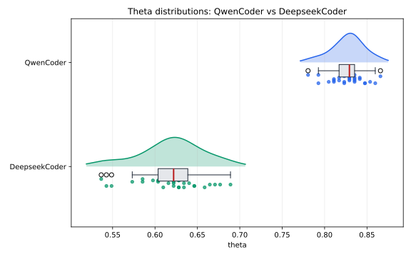

# SafeLLM4SE

SafeLLM4SE is a Python toolkit for statistically principled evaluation of
LLM-based software engineering systems. It treats each LLM execution as a
sample from a stochastic process, then reports quality, stability, uncertainty,
resource usage, and statistical comparisons instead of relying on a single run.

The project exposes three command-line programs:

- `sample.py`: runs adaptive sampling with a user-selected evaluator.
- `report.py`: summarizes one sampled task into a SafeLLM4SE report CSV.
- `compare.py`: compares two sampled tasks with the SafeLLM4SE comparison protocol.

## Install

SafeLLM4SE requires Python 3.10 or newer.

```bash
python -m venv .venv
.venv\Scripts\activate
python -m pip install --upgrade pip
python -m pip install loguru
```

Optional packages:

```bash
# Better statistical tests and KDE/normality checks
python -m pip install scipy

# SVG plots requested with --boxplot, --violin, --ecdf, --raincloud, or --kde
python -m pip install matplotlib

# Example HumanEval evaluators
python -m pip install datasets

# Gemini and Groq example evaluators
python -m pip install google-genai groq
```

Ollama evaluators use Python's standard HTTP library, but require a running
Ollama service and the selected local model, for example:

```bash
ollama pull qwen2.5-coder:7b
```

More detail: [Installation](doc/INSTALLATION.md).

## Quick Start

Run adaptive sampling with a built-in random evaluator:

```bash
python sample.py --evaluator sampling.myevaluators.random_binary_evaluator --task-id demo-binary --n-min 10 --target-ci-width 0.20 --budget-tokens 10000 -- success_probability=0.7
```

Generate a report and a plot:

```bash
python report.py --input output/measurements.csv --output output/report-demo.csv --task-id demo-binary --boxplot output/demo-boxplot.svg
```

Compare two tasks:

```bash
python compare.py --input output/measurements.csv --output output/compare-demo.csv --task-id-1 task-a --task-id-2 task-b --test-type independent --raincloud output/compare-demo-raincloud.svg
```

Detailed examples: [Usage Guide](doc/USAGE.md). Full parameter reference:
[CLI Reference](doc/CLI_REFERENCE.md).

## Example Output

A `report.py` CSV contains one row with sample size, token usage, central
tendency, variability, and confidence interval information:

```csv
task_id,model_name,model_id,N,total_tokens,theta_mean,sd,ci_method,ci_low,ci_high,ci_width
task-id-54,qwen-coder,qwen2.5-coder:7b,30,1178530,0.8272357723577236,0.019436705668000667,t,0.8199779871829312,0.834493557532516,0.014515570349584728
```

A `compare.py` CSV reports the estimated difference, confidence interval,
statistical test, p-value, and effect size:

```csv
task_id_1,task_id_2,test_type,estimated_difference,ci_low,ci_high,statistical_test,p_value,effect_size_name,effect_size,effect_size_magnitude
task-id-54,task-id-56,independent,0.20833333333333337,0.19369410569105683,0.2223628048780488,Mann-Whitney U,2.8591961948613224e-11,Cliff's delta,1.0,large
```

Example generated plot:



## Documentation

- [Methodology](doc/METHODOLOGY.md)
- [Installation](doc/INSTALLATION.md)
- [Usage Guide](doc/USAGE.md)
- [CLI Reference](doc/CLI_REFERENCE.md)
- [Evaluator Guide](doc/EVALUATORS.md)

## License

See [LICENSE](LICENSE).
